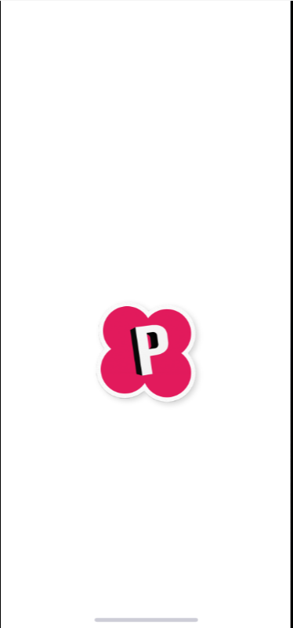
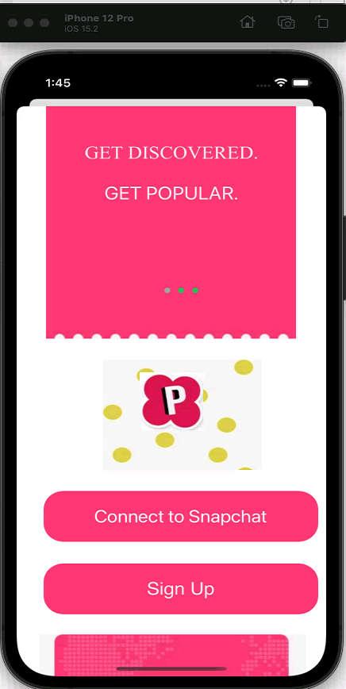
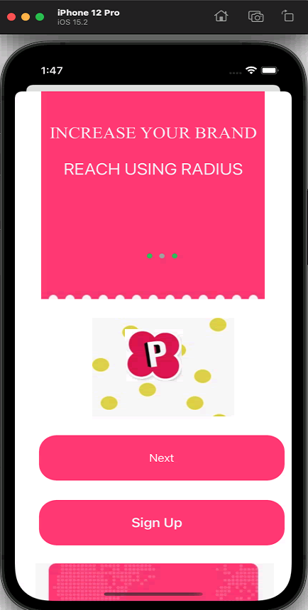
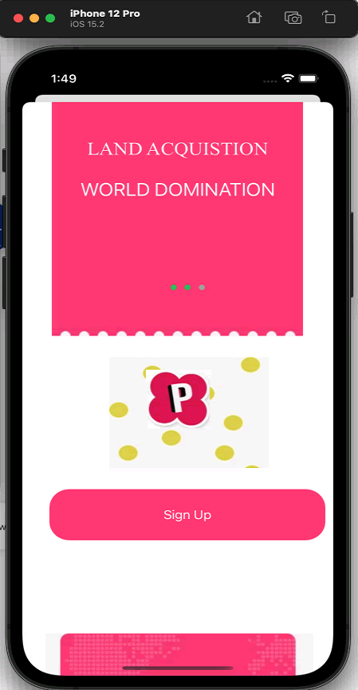
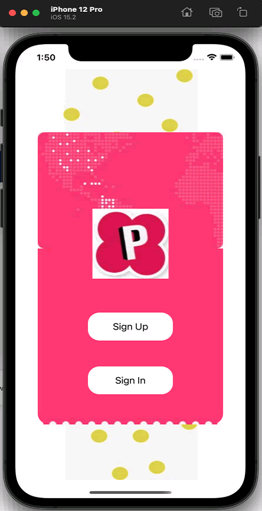
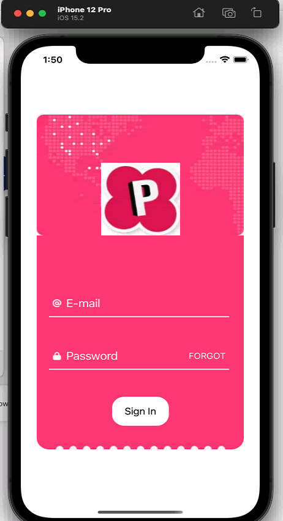
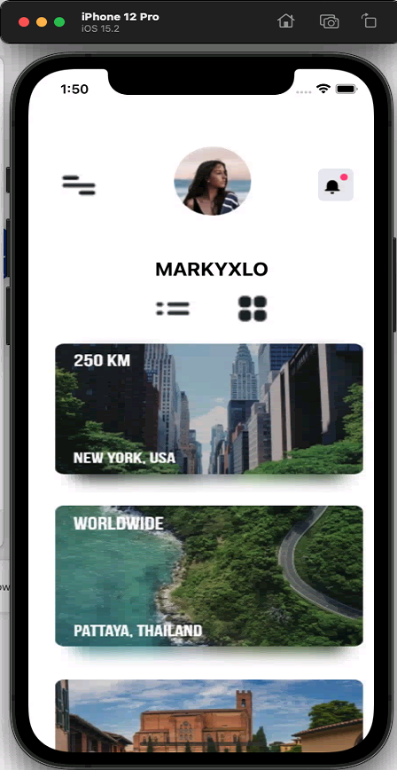
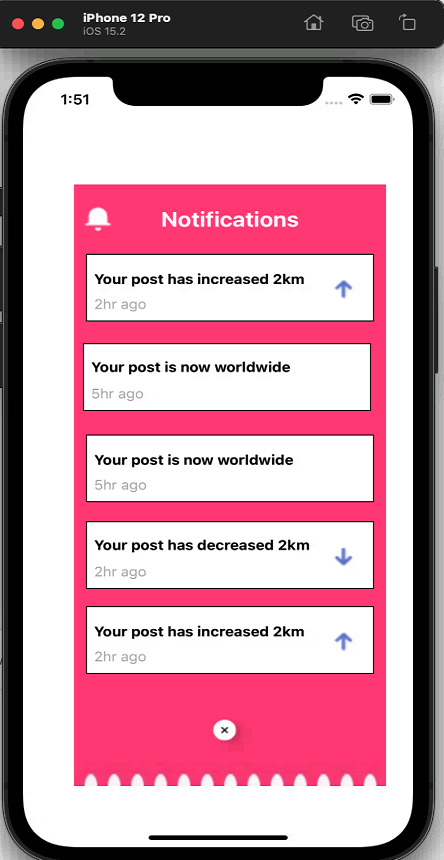
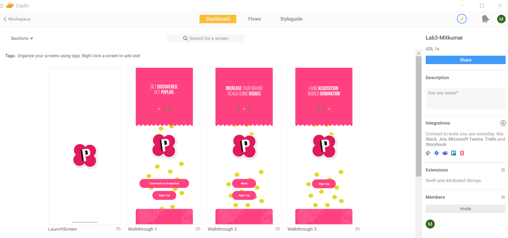
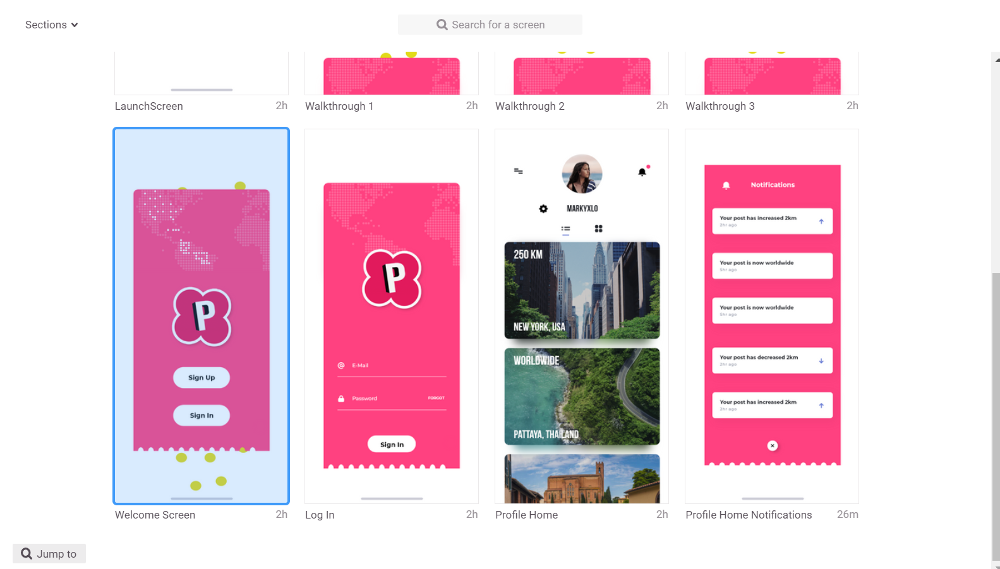

# Lab3-Mitkumar

## Create an App with Adobe XD design and implement in the Xcode.

  ### > I created the Project by making small changes into popular.xd files.

  ### > **I will recommand you to run this project on iPhone 12 pro emulator for better visuals.**

# Steps

+ Initially, user will see the Splash Screen with logo.
 # 

+ After that with navigation controller we will redirect to the Walkthrough 1
+ In the first walkthrough, I created the Common view with 2 Labels and Navigation dots.
+ Here, user will find the 2 buttons, which will redirect them into different navigation pages.
 # 

+ If user click on the connect to Snapchat button, then it will redirect to the Walkthrough 2.
 # 

+ In the Walkthrough 2, if user click on the Next button then it redirect to the Walthrough 3.
+ If user click on the Sign in Button in Walthrough 1 or 2, then user will automatically redirect to the Sign in page.
+ In the last user will come across with Welcome Screen.
  
 #   # 

+ If user click on the Sign in then the Sign in page will appear.
  
 # 

+ If user click on the Sign in agin then the user can see the profile page.
  
 # 

+ If user click on the Notification icon on the top right corner then user can see the notification page.
  
 # 

+ Here I am provining the Images for the Zeplin and also I uploaded my Adobe XD file here. So you can see the Design.
  
 #         # 

 - For the reference, I am proving the Web View link for the Zeplin.
 - https://zpl.io/MdkxK5d
